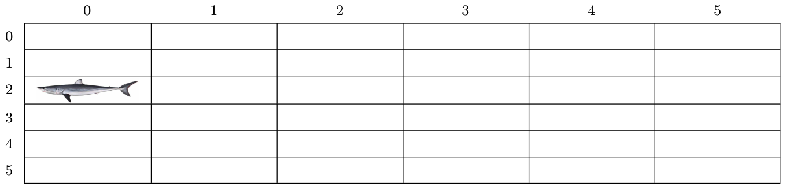
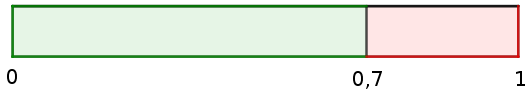
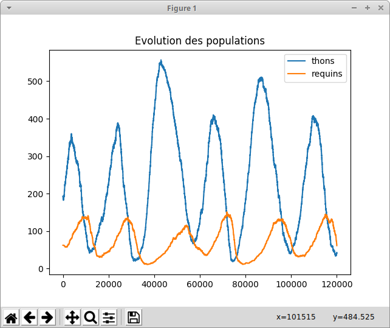
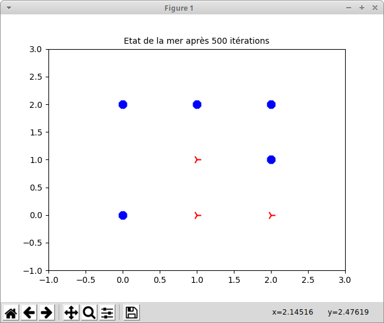
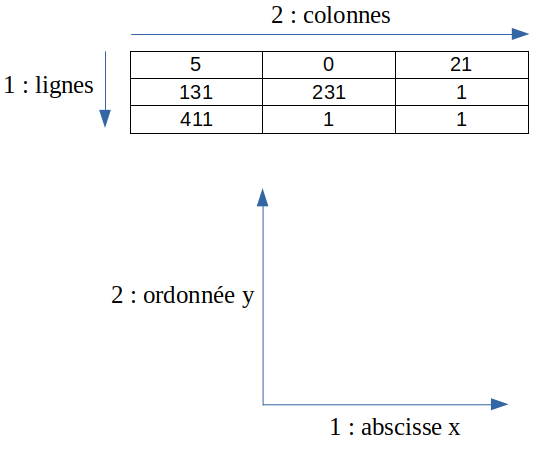
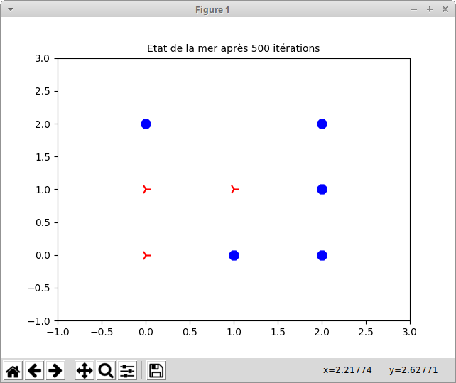

Améliorations possibles
----
suite aux discussions avec les collègues, on pourrait ajouter :
* une phase d'appropriation de la simulation en faisant pratiquer les élèves sur une grille papier, en activité débranchée
* on peut aussi débuter la partie programmation en ne simulant que le déplacement d'un thon, puis de plusieurs thons, etc

WA-TOR
------
L'objectif de ce TP est de mettre en place une simulation de type [Wa-tor](https://en.wikipedia.org/wiki/Wa-Tor), 
dans laquelle on observe l'évolution dans une mer de deux populations de poissons : des thons et des requins ; cette évolution suivant des règles précises.

Modélisation
------

On suppose que les poissons évoluent dans une mer vue comme une grille *torique* :

(source de l'image : Wikipédia)

Pour simuler cette grille, nous considérerons simplement un tableau à double entrée :

par exemple, si un requin est dans la case (0 ; 2) et veut se déplacer vers la gauche alors il se retrouvera dans la case (5 ; 2). La grille pourra être plus grande que celle représentée ci-dessus.

Dans chaque case de cette mer, peuvent se trouver trois choses :
*  soit un thon (une proie) ;
*  soit un requin (un prédateur) ;
*  soit de l'eau !

Pour éviter d'augmenter inutilement le nombre de paramètres des fonctions, nous définirons quelques constantes globales, dont `NB_LIGNES` et `NB_COLONNES` qui définissent les dimensions 
du tableau représentant la mer.

Le temps qui s'écoule est ici modélisé par une variable *temps*, qui augmentera de façon régulière d'une unité (dans la suite du TP, nous appelerons cette augmentation une *itération*).

A chaque itération, l'algorithme devra choisir une case au hasard ; si elle est vide, il ne se passe rien mais si elle est occupée par un poisson alors on appliquera les règles définies ci-dessous.

Les déplacements des poissons
------

A chaque itération, un poisson (thon ou requin) choisit au hasard un déplacement d'une case horizontalement ou verticalement, il n'a donc que 4 choix possibles (4 cases voisines pour une case choisie au hasard).

* le thon ne peut se déplacer que sur une case vide ; si les 4 cases voisines sont occupées alors il reste à sa place ;
* le requin va d'abord regarder s'il y a un thon sur une des cases voisines, si oui il s'y déplacera et dévorera ce thon ; sinon il se déplacera sur une case vide. 
Enfin, si les 4 cases voisines sont occupées par des requins alors il reste à sa place.

Vie et mort
---------
*  un thon vit éternellement tant qu'il n'est pas dévoré par un requin ;
*  un requin doit se nourrir pour survivre, après un certain temps sans manger, il meurt.

Le temps de survie sans manger d'un requin est défini au départ et est le même pour tous les requins. On créera pour cela une constante `ENERGIE_MAX_REQUIN`.

A chaque itération, si un requin ne mange pas alors son niveau d'énergie est diminué de 1. Quand ce niveau est égal à 0 alors il meurt.

Naissance des poissons
---------
Les poissons ont un temps de gestation défini au départ (le même pour tous les membres d'une espèce mais qui peut être différent pour les thons et les requins).

On créera pour cela deux constantes `DUREE_GESTATION_THON` et `DUREE_GESTATION_REQUIN`.

Après un certain temps, un poisson (qui a survécu !) pourra donner naissance, lors d'un déplacement, à un nouveau poisson qui occupera la case quittée.

Pour cela, à chaque itération, le temps de gestation d'un poisson est diminué de 1 et lorqu'il arrive à 0 :
* une naissance survient si la mère s'est déplacée ;
* aucune naissance ne survient si la mère n'a pas pu se déplacer ;
* dans tous les cas, le compteur de gestation de la mère est remis à sa valeur initale.

Création d'une mer vide
-----------------------

Une grille peut être représentée par une liste de listes en Python.

Par exemple, une grille vide de poisson de trois lignes sur trois colonnes s'écrira :

    [[0,0,0],[0,0,0],[0,0,0]]

Ecrivez une commande qui génère une liste de mille zéros.

Ecrivez une fonction `creer_mer` qui prend en entrée le nombre de cases horizontalement et verticalement et retourne une grille vierge.

    >>> creer_mer(3,3)
    [[0,0,0],[0,0,0],[0,0,0]]

Pensez à écrire la DOCSTRING et/ou le DOCTEST des fonctions de ce TP, comme nous l'avons vu en cours.

Représentation du contenu des cases
---------------

Nous choisissons ici de limiter les durées à deux chiffres, entre 0 et 99 donc 
(on pourrait limiter à un chiffre, sans quoi les rythmes des naissances et des morts seraient trop lents).

Il existe différentes façons de représenter le contenu des cases, par exemple :
* en créant 3 tableaux, un pour le type (eau, thon ou requin), un pour les temps restants avant une naissance et un pour l'énergie des requins ;
ce dernier serait en grande partie vide s'il y a peu de requins ;

* en utilisant un code alphanumérique (pouvant être facilement découpé avec la méthode `split()`) du genre :
    * "r_12_05" pour un requin qui peut donner naissance dans 12 itérations et qui a encore 5 points d'énergie (encore 5 itérations avant de mourir) ;
    * "t_08" pour un thon qui peut donner naissance dans 8 itérations ;
    * "v" pour une case vide

* un code numérique :
    * 0 pour une case vide ;
    * le temps restant avant une naissance (entre 0 et la durée de gestation) pour un thon, ce qui donne un nombre inférieur à 100 ;
    * energie\*100+temps_avant_naissance, ce qui donne un nombre supérieur ou égal à 100, pour un requin (non mort...). Ainsi, un requin qui peut donner naissance dans 12 itérations et 
    qui a encore 5 points d'énergie sera associé au code 512.

Nous choisirons cette représentation à code numérique, qui limite les structures de données (un seul tableau), les calculs dans la plupart des cas et n'utilise pas de 
manipulations de chaînes.

Remarque : en plus des constantes `DUREE_GESTATION_THON`, `DUREE_GESTATION_REQUIN` et `ENERGIE_MAX_REQUIN`, on pourra aussi définir 
les constantes `CODE_REQUIN_NOUVEAU` et `CODE_THON_NOUVEAU` qui représentent les codes associés à un nouveau poisson (ce qui permet d'éviter de recalculer ces codes à chaque naissance).

Remplissage initial de la mer
------------------

Nous souhaitons disposer dans notre mer vide quelques poissons en fonction de certains pourcentages, par exemple nous pourrions demander d'avoir *environ* 70 % de thons 
et 20 % de requins.

Pour les thons, nous pourrions imaginer que nous disposons d'une pièce truquée qui tombe sur "Pile" dans 70 % des cas.
Afin de modéliser ceci, nous allons demander à l'ordinateur de choisir un nombre au hasard compris entre 0 et 1, si ce nombre est inférieur à 0,7 alors la machine engendrera un thon.

Réalisez une fonction `generer` qui prend en paramètre une probabilité *proba* et renvoie 1 dans 100* *proba* % des cas et 0 dans les autres cas.

    >>> generer(0.7)
    1
    >>> generer(0.7)
    0
    
Pour tester un peu plus votre fonction, vous pouvez créer une liste de valeurs choisies aléatoirement et compter le nombre de 1, par exemple :

    >>> liste=[generer(0.7) for i in range(0,1000)]
    >>> liste.count(1)
    683

il y a ici 683 "1" sur 1000 nombres soit une probabilité de 0,683 (proche de 0,7).

Réalisez ensuite une fonction `peupler_mer` qui prend en paramètres *mer,p,q* où *mer* est une liste de listes, *p* et *q* sont des pourcentages et qui va utiliser la fonction `generer` pour 
peupler la grille *mer* en fonction du pourcentage de thon *p* et du pourcentage de requins *q*.
Ainsi,

    >>> peupler_mer(mer,30,10)
remplira la grille *mer* avec environ 30 % de thons et 10 % de requins.

Remarque logique : dans chaque case, la fonction va d'abord éventuellement placer un thon puis, sinon, un requin dans q % *des cases vides*, 
cela ne représentera donc plus q % de la mer !
Pour corriger cela, un simple raisonnement montre que la fonction devra commencer par modifier *q* en *q/(100-p)*.

Pensez à tester votre fonction en affichant le pourcentage de requins dans la mer :

    >>> ma_mer = creer_mer_vide(NB_LIGNES,NB_COLONNES)
    >>> peupler_mer(ma_mer,30,10)
    >>> s=0
    >>> for liste in ma_mer:
            s = s+liste.count(CODE_REQUIN_NOUVEAU)
    >>> 100*s/(NB_LIGNES*NB_COLONNES),'% de requins'

Choix d'une case au hasard
--------

A chaque itération, nous commençons par choisir une case au hasard.

Ecrivez une fonction `choisir_case` qui choisit une case au hasard, entre (0,0) et (NB\_LIGNES-1,NB\_COLONNES-1).

    >>> choisir_case()
    (32,87)

par exemple.

Analyse du contenu d'une case
-----------

A chaque itération, nous aurons besoin de contrôler le contenu de la case choisie au hasard.

Réalisez trois fonctions `voir_genre`, `voir_temps_naissance` et `voir_energie_requin`
qui regardent dans la case *(x,y)* de la grille *mer* et retournent respectivement le genre de poisson, 
le temps restant avant une nouvelle naissance (pour un poisson) et l'énergie restante (pour un requin).

Remarque : la fonction `voir_genre` peut retourner 0 pour de l'eau, 1 pour un thon et 2 pour un requin.

    >>> ma_mer = [[312, 18, 5345], [23, 0, 0], [100, 999, 1]]
    >>> voir_genre(ma_mer,0,0)
    2
    >>> voir_genre(ma_mer,1,0)
    1
    >>> voir_genre(ma_mer,1,2)
    0
    >>> voir_temps_naissance(ma_mer,0,0)
    12
    >>> voir_temps_naissance(ma_mer,1,0)
    23
    >>> voir_temps_naissance(ma_mer,1,2)
    0
    >>> voir_energie_requin(ma_mer,0,0)
    3
    >>> voir_energie_requin(ma_mer,0,2)
    53

Gestion des déplacements autorisés
-----------------

Réalisez une fonction `choisir_deplacement` qui choisit aléatoirement un déplacement parmi les quatre possibles : (1,0) ou (0,1) ou (-1,0) ou (0,-1).

    >>> choisir_deplacement()
    (-1,0)
    >>> choisir_deplacement()
    (0,1)

Quand un poisson est en bordure de la mer, il risque de sortir de la mer au déplacement suivant !
Par exemple, s'il est sur le bord droit, et veut se déplacer vers la droite, il faut le transporter complétement à gauche.

Réalisez une fonction `calculer_nouvelle_case` qui rectifie les coordonnées d'une case en gérant le cas où x > `NB_LIGNES-1` et/ou y > `NB_COLONNES-1`.

    >>> NB_LIGNES,NB_COLONNES = 20,20 # ici x et y ne peuvent aller que de 0 à 19
    >>> calculer_nouvelle_case(20,3)
    (0,3)
    >>> calculer_nouvelle_case(1,5)
    (1,5)
    >>> calculer_nouvelle_case(-1,20)
    (19,0)

Remarque : vous pouvez utiliser l'opérateur `%` (*modulo*) de Python.

Réalisez une fonction `choisir_case_autour` qui choisit un déplacement parmi une liste de déplacements donnée en paramètre et l'applique aux coordonnées également données en paramètres
puis retourne les coordonnées adaptées à la mer (avec la fonction `calculer_nouvelle_case`) ainsi que le numéro de déplacement choisi.

    >>> NB_LIGNES,NB_COLONNES = 3,3 # ici x et y ne peuvent aller que de 0 à 2
    >>> deplacements = [(-1,0),(0,1),(0,-1)]
    >>> choisir_case_autour(0,1,deplacements)
    (2,1,0)
    >>> choisir_case_autour(0,1,deplacements)
    (0,2,1)
    >>> choisir_case_autour(0,1,deplacements)
    (0,0,2)

Le premier résultat est (2,1,0), ce qui signifie "les nouvelles coordonnées sont (2,1), suite au déplacement n°0".
En effet, si l'ordinateur choisit le déplacement 0, c'est-à-dire (-1,0), et l'applique aux coordonnées (fournies en paramètres) de départ (0,1), cela donne les coordonnées (-1,1), 
qui sont rectifiées en (2,1).

Recherche dans les cases voisines
----------

Un thon recherche une case vide et un requin cherche d'abord un thon et, s'il n'en trouve pas, cherche une case vide.

Ecrivez une fonction `chercher_autour` qui cherchera, dans les quatre cases voisines de la case (x,y) de la mer, un objectif (case vide = 0 ou thon = 1).
Cette fonction retourne les coordonnées de la case contenant l'objectif recherché ou, si l'objectif n'existe pas dans les cases voisines, elle retournera (-1,-1).

    >>> NB_LIGNES=3
    >>> NB_COLONNES=3
    >>> ma_mer=[[12,0,31],[22,35,18],[41,57,36]]
    >>> chercher_autour(ma_mer,0,0,0) # recherche d'une case vide autour de la case (0,0)
    (0,1)
    >>> chercher_autour(ma_mer,0,0,1) # recherche d'un thon autour de la case (0,0)
    (0,2)
    >>> chercher_autour(ma_mer,0,0,1) # recherche d'un thon autour de la case (0,0)
    (2,0)
    >>> chercher_autour(ma_mer,0,0,1) # recherche d'un thon autour de la case (0,0)
    (1,0)

Constatez que les cases (0,2), (2,0) et (1,0) sont bien voisines de la case (0,0) et contiennent un thon.

Conseil : votre fonction pourra utiliser la fonction `choisir_case_autour`.

Comportement d'un thon
---------

Ecrivez une fonction `comportement_thon` qui accepte trois paramètres : une liste de listes représentant la mer et les coordonnées d'une case.

Cette fonction devra s'occuper du déplacement éventuel du thon, de la réduction du temps avant une prochaine naissance ainsi que de la naissance éventuelle d'un nouveau thon.

Remarque : pensez à utiliser certaines des fonctions définies précédemment bien sûr !

    >>> NB_LIGNES=3
    >>> NB_COLONNES=3
    >>> DUREE_GESTATION_THON = 2
    >>> ma_mer=[[2,0,2],[131,231,1],[411,1,1]]
    >>> comportement_thon(ma_mer,0,0)# pour agir sur le thon présent en (0,0)
    >>> ma_mer
    [[0, 1, 2], [131, 231, 1], [411, 1, 1]]
    >>> comportement_thon(ma_mer,0,1)# pour agir sur le thon présent en (0,1)
    >>> ma_mer
    [[2, 2, 2], [131, 231, 1], [411, 1, 1]]
    >>> comportement_thon(ma_mer,2,1)# pour agir sur le thon présent en (2,1)
    >>> ma_mer
    [[2, 2, 2], [131, 231, 1], [411, 2, 1]]

Ici : 
* au premier appel de la fonction `comportement_thon` le thon présent en (0,0) s'est déplacé en (0,1) et a réduit son 
temps avant naissance à 1
* au deuxième appel de la fonction `comportement_thon` le thon présent en (0,1) s'est déplacé en (0,0), a réduit son temps avant naissance à 0 ce qui a impliqué 
la naissance d'un nouveau thon en (0,1) et la remise au maximum du temps avant naissance pour le thon déplacé
* au troisième appel de la fonction `comportement_thon` le thon présent en (2,1) n'a aucune case vide autour de lui, il ne peut se déplacer ; son temps avant naissance 
passe à 0 mais comme il ne s'est pas déplacé il n'y a pas de naissance d'un nouveau thon mais la remise au maximum du temps avant naissance a lieu quand même.

Comportement d'un requin
---------
Le comportement d'un requin est plus compliqué que celui d'un thon, nous allons décomposer celui-ci en trois fonctions.

Réalisez une fonction `deplacer_sans_engendrer_requin` qui accepte sept paramètres : une liste de listes représentant la mer, les coordonnées de la case de départ *(x,y)*, les 
coordonnées de la case d'arrivée *(x_fin,y_fin)*, l'énergie réduite d'une unité du requin (supposée non nulle ici) et le temps restant la prochaine naissance, réduite d'une unité
(supposé non nul ici).

Cette fonction devra juste s'occuper de déplacer le requin de (x,y) vers (x\_fin,y\_fin).

    >>> ma_mer=[[2,0,2],[131,231,1],[411,1,1]]
    >>> deplacer_sans_engendrer_requin(ma_mer,2,0,2,1,3,10)# déplacement du requin présent en (2,0) vers (2,1), son énergie après réduction est 3 et son temps av. naiss. 10
    >>> ma_mer
    [[2, 0, 2], [131, 231, 1], [0, 310, 1]]

Réalisez une fonction `deplacer_et_engendrer_requin` qui accepte six paramètres : une liste de listes représentant la mer, les coordonnées de la case de départ *(x,y)*, les 
coordonnées de la case d'arrivée *(x_fin,y_fin)* et l'énergie actuelle du requin réduite d'une unité (supposée non nulle ici).

Cette fonction devra s'occuper du déplacement du requin de (x,y) vers (x\_fin,y\_fin), donnera naissance à un nouveau requin dans la case (x,y) et remettra également au maximum 
le temps avant une nouvelle naissance du requin adulte.

    >>> DUREE_GESTATION_REQUIN = 6
    >>> ENERGIE_MAX_REQUIN = 3
    >>> CODE_REQUIN_NOUVEAU = 306
    >>> ma_mer=[[2,0,2],[131,201,1],[411,1,1]]
    >>> deplacer_et_engendrer_requin(ma_mer,1,1,2,1,1)# déplacement du requin présent en (1,1) vers (2,1), son énergie après réduction est 1 (et son temps av. naiss. est remis au max)
    >>> ma_mer
    [[2, 0, 2], [131, 306, 1], [411, 106, 1]]
    
Enfin, réalisez une fonction `comportement_requin`  qui accepte trois paramètres : une liste de listes représentant la mer et les coordonnées de la case de départ *(x,y)*
et qui gère tous les comportements possibles du requin. 

Conseils : 
* il est vivement conseillé d'utiliser certaines des fonctions créées précédemment ;
* vous pouvez commencer par écrire sur papier un organigramme regroupant tous les cas de figure.

(exemple d'organigramme, [source](http://larp.marcolavoie.ca/fr/DocHTM/9900.htm))

Nombre de thons et de requins
-----

Réalisez une fonction `compter_poissons` qui a pour paramètre une liste de listes représentant la mer et qui affiche le nombre de thons et le nombre de requins qui y sont présents.

    >>> ma_mer=[[2,0,2],[131,201,1],[411,1,1]]
    >>> compter_poissons(ma_mer)
    Il y a 5 thons et 3 requins.

Lancement de la simulation
-----

Ecrivez une fonction `wator` qui prend trois paramètres : les pourcentages initiaux *p* et *q* de thons et de requins et le nombre d'itérations total *n*.
Cette fonction effectuera toutes les étapes de la simulation et affichera le nombre de poissons à la fin.

    >>> wator(30,10,100000)
    Il y a 93 thons et 72 requins.
    >>> wator(30,10,100000)
    Il y a 200 thons et 12 requins.    

Remarque : les résultats ci-dessus ont été obtenus avec les paramètres donnés à la fin de ce TP.

Compléments : affichages divers
-------------

La fonction `wator` ne donne que l'état final de la mer mais il serait préférable d'afficher l'évolution des populations ou l'état de la mer en fonction du temps.

Nous proposons ici trois façons de visualiser cette simulation :
* à l'aide de courbes modélisant l'évolution des nombres de thons et de requins au cours du temps ;
* en affichant textuellement l'état de la mer dans la console toutes les, par exemple, 100 (ou 1000 ou ...) itérations ;
* en affichant l'état de la mer dans une fenêtre graphique.

Ces nouvelles fonctions pourront être appelées dans la fonction `wator`.

**Courbes d'évolutions**

Créez des variables globales :
* `nb_thons` et `nb_requins` qui désigneront ... le nombre de thons et de requins à un moment ;
* `etats` qui est une liste contenant le nombre de thons et de requins pour toutes les étapes.

Par exemple, après 5 itérations, la liste `etats` pourrait ressembler à cela :

    [[35,12],[35,12],[35,12],[36,12],[36,11],[36,11]]

Modifiez vos fonctions pour qu'elles changent les valeurs de ces variables quand nécessaire...
(rappel : utilisez le mot clé `global` de Python).

Remarques : 
* la création des variables `nb_thons` et `nb_requins` rendent inutile la fonction`compter_poissons` (à part la commande d'affichage) ;
* la fonction `wator` peut retourner la liste `etats`.

Pour dessiner les deux courbes d'évolution des populations, on peut utiliser le module `pylab`.

Voici un exemple de syntaxe est  :

    import pylab
    data_x = [-2,-1,0,3,8] # une liste d'abscisses
    data_y = [5,-3,2,1,4] # une liste d'ordonnées
    pylab.plot(data_x, data_y,label='une légende pour cette courbe')
    pylab.legend(loc='upper right')
    pylab.title('Evolution des populations')
    pylab.show()

Ecrivez une fonction `afficher_courbes` qui prend en paramètre le nombre total d'itérations et qui affiche les courbes d'évolution des deux populations, en se basant sur la variable globale
`etats`.

Voici alors ce que l'on peut obtenir (voir les paramètres utilisés à la fin de ce TP) :

**Affichage textuel de la mer**

Nous pourrions afficher la liste de listes mais le rendu n'en serait pas agréable.

Réalisez une fonction `afficher_mer_textuel` qui prend deux paramètres : la liste de listes *mer* et le nombre actuel d'itérations.
Les cases vides (ou pleine d'eau...) seront affichée avec un tiret bas '_' ; les cases contenant un requin seront affichées avec un 'R' 
et celles contenant un thon seront affichées avec un 'T'.

Vous laisserez un espace entre chaque case d'une ligne et passerez à la ligne à chaque nouvelle ligne de la mer.

    >>> ma_mer=[[5,0,21],[131,231,1],[411,1,1]]
    >>> afficher_mer_textuel(ma_mer,500)
    Après 500 étapes :
    T _ T 
    R R T 
    R T T 

**Affichage graphique de la mer**

Nous pouvons aussi afficher la mer dans une fenêtre graphique.

Réalisez pour cela une fonction `afficher_mer_visuel` qui prend deux paramètres : la liste *mer* et le nombre actuel d'itérations.

    >>> NB_LIGNES,NB_COLONNES=3,3
    >>> ma_mer=[[5,0,21],[131,231,1],[411,1,1]]
    >>> afficher_mer_visuel(ma_mer,500)

va donner :

Vous l'aurez sans doute remarqué, les poissons ne sont pas au même endroit qu'avec la fonction `afficher_mer_textuel`, 
cela est dû à la différence entre le parcours d'une liste et les coordonnées cartésiennes :

Moyennant une transformation de coordonnées (à savoir (x,y) -> (y, NB_LIGNES-1-x)), on obtient :

Phénomènes observables
--------

Les durées de gestation des deux espèces et l'énergie récupérée par un requin lorsqu'il mange un thon sont des paramètres de la simulation. S'ils sont bien choisis on peut voir émerger 
différents phénomènes d'évolution des populations :

* soit les deux populations disparaissent (c'est le cas par exemple quand il y a trop de requins, ceux-ci risquent de manger tous les thons puis ils mourront de faim ensuite) ;
* disparition des requins (si l'energie récupérée est trop basse et/ou leur temps de gestation trop long ou s'il y a trop peu de thons au départ) ;
* régulation des deux espèces : aucune des deux espèces ne disparaît.

Pour obtenir ce dernier cas, il faut respecter les inégalités suivantes :
durée gestation des thons < énergie des requins < durée gestation des requins

Quelques valeurs suggérées :
* durée gestation des thons = 2
* durée gestation des requins = 6
* energie max des requins = 3
* 30 % de thons et 10 % de requins au départ
* grille de 25 sur 25
* plus de 100000 itérations

